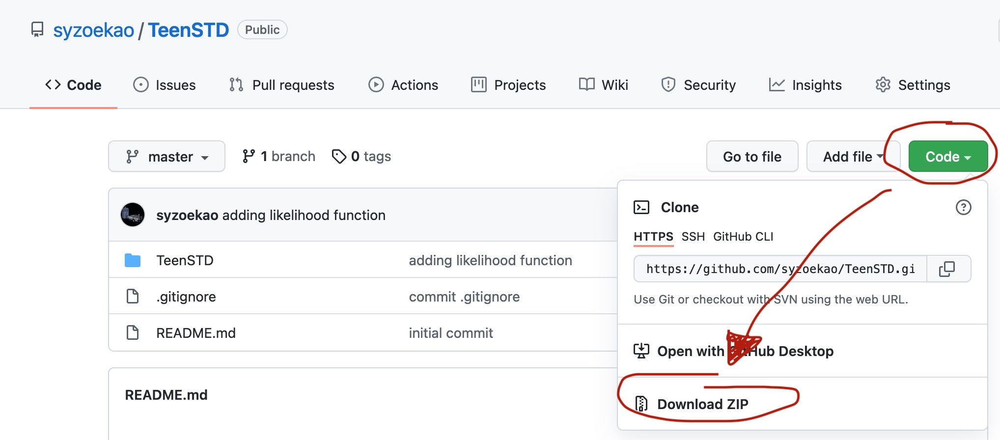

# Using multiple outcomes of sexual behavior to provide insights into chlamydia transmission and the effectiveness of prevention interventions in adolescents

This repository contains an `R` package (`TeenSTD`) for the published study, "Using multiple outcomes of sexual behavior to provide insights into chlamydia transmission and the effectiveness of prevention interventions in adolescents." Mathematical models developed for evaluating interventions are usually developed for the disease of interest alone, and calibrated to the observed epidemiological trend (e.g., disease incidence) of the disease of interest. However, incorporating additional outcomes generated by the same underlying disease dynamics may improve the precision of the unknown parameters estimated in the calibration process and lead to different policy implication. In this study, we modeled the spread of chlamydia among heterosexual adolescents aged 15-19 years in Minnesota in two calibration scenarios: (1) **chlamydia calibration**: calibrating the model to chlamydial incidence alone from 2005 to 2013, and (2) **dual calibration**: calibration the model to both chlamydial incidence and pregnancy trend from 2005-2013. The details of the study objective, methods, and findings can be found [here](https://www.ncbi.nlm.nih.gov/pmc/articles/PMC5711443/pdf/nihms875380.pdf).

In this study, compartmental model with differential equations was used to model the chlamydial transmission dynamics and pregnancy. The model code maintained in this repository was developed for the **dual calibration** scenario, which calibrated to both the chlamydial incidence and pregnancy incidence in 2005-2013 in Minnesota. The model code and the related datasets were provided in the `R` package. In this `README` file, we summarized the structure of the repository, and the components and the use of the package. Here is the outline of this `README` document: 

1. Provided the instructions regarding downloading and installing the `TeenSTD` package.
2. Outlined the components of the package (raw data, model parameters, and model code). 
3. Executed the model code using calibrated parameters. 

## Installing `TeenSTD` package

Before downloading the folder and installing the package, please make sure that `R` is installed on your computer or laptop. If you have `R` and `RStudio` installed, the following steps showed how to download and install the packages. 

* Download/clone the repository


    * If you have terminal, open terminal and type: 
        
        ```
        git clone https://github.com/syzoekao/TeenSTD.git
        ```
    

    * If you don't have terminal, go to the main repository page and download the zip file following the image below: 
    
        
    

* Go to the directory of the repository that was downloaded on your device. Here is an outline of the folder structure: 

    ```
    TeenSTD                        # This is the main folder
      |-- README.md                # README file of the      
      |-- Figs                     # Folder contains figures used in README
      |-- example_simulation.R     # Folder contains figures used in README      
      |-- TeenSTD                  # R package folder
      |       |-- TeenSTD.Rproj    # TeenSTD Rproject file
      |       |-- R                # Contains all functions in development
      |       |-- data             # Data that are converted for R package use
      |       |-- inst             # This includes raw data and `make_package.R` 
      |       |-- man              # Manual
      |       |-- test             # Test script
      |       |-- DESCRIPTION      # Basic information of the package and installation requirement  
      |       |-- NAMESPACE        
    ```
    
    * Go to the `TeenSTD` subfolder and open `TeenSTD.Rproj`. This should open the `RStudio` software. 

* To install `TeenSTD` package, open `make_package.R` in the folder `TeenSTD/test/`, and execute the script. 

* If the script is executed without error, the package should be installed in the `R` library. To check the existence of `TeenSTD` package, type the following code in the console in `RStudio`: 

    ```
    library(TeenSTD)
    ```

## Components of the package

This package consists of three primary components: (1) data, (2) input parameters, and (3) the disease model including both chlamydia transmission and pregnancy and likelihood. Scripts for both input parameters and disease model are located in folder `TeenSTD/R/`. 

1. **[Data](https://github.com/syzoekao/TeenSTD/tree/master/TeenSTD/data) includes four datasets**: 

    * `MDH_data.rda`: contains the calibration targets, chlamydial incidence by men (`obsM1`) and women (`obsF1`) from 2005 to 2013. The incidence is calculated as a proportion of the population. 
    * `preg_data.rda`: contains the calibration targets, pregnancy incidence (`obs`), which is calculated as a proportion of the population. 
    * `sex_behave_data.rda`: includes the relevant sexual behavioral information among adolescents in Minnesota. 
    * `posterior_set.rda`: contains 1000 sample sets of calibrated parameters for dual calibration scenario. 
\
\
2. **Input parameters**: 

    Because the transition between compartments in compartmental models was described using **transition rates**, many input parameters were converted from probabilities to rates in the monthly timestep. The function [`create_parameters()`](https://github.com/syzoekao/TeenSTD/blob/master/TeenSTD/R/parameters.R) calculates the transition rates and relevante input parameters for this model. 

3. **Disease model and likelihood**: 
    
    * Disease dynamic is programmed in [`transmission_model()`] (https://github.com/syzoekao/TeenSTD/blob/abf7bc2ed3b898e65c9b5e1a08070eb930f57d02/TeenSTD/R/transmission.R#L8-L160). This function programs the inflow and outflow of the population from one compartment to the next compartment at a cycle. The compartments in this function include: susceptible (S), asymptomatic infection (Ia), symptomatic infection (Is), treated (T), pregnancy (P), pregnant with asymptomatic infection (Ia_P), pregnant with symptomatic infection (Is_P), tested positive during pregnancy (Scr_P). 
    * The function [`process_output()`](https://github.com/syzoekao/TeenSTD/blob/abf7bc2ed3b898e65c9b5e1a08070eb930f57d02/TeenSTD/R/transmission.R#L163-L251) calculates the outcomes, which is incidence, accumulative over each year. 
    * The function [`calibrate_likelihood()`](https://github.com/syzoekao/TeenSTD/blob/abf7bc2ed3b898e65c9b5e1a08070eb930f57d02/TeenSTD/R/transmission.R#L256-L264) calculates the likelihood for each parameter set based on the assumption of normal distribution around each target. 
    
## Execude model code

To test run the code, please go to the main directory at the top level (`TeenSTD/` instead of `TeenSTD/TeenSTD`) and find [`example_simulation.R`](https://github.com/syzoekao/TeenSTD/blob/master/example_simulation.R). Open this Rscript in Rstudio and execute the entire script. This script will generate three figures showing the trend of chlamydial incidence for men and women and the pregnancy incidence from 2005 to 2013. The figures include the posterior trends and uncertainty and the targets. 


    
    


    


